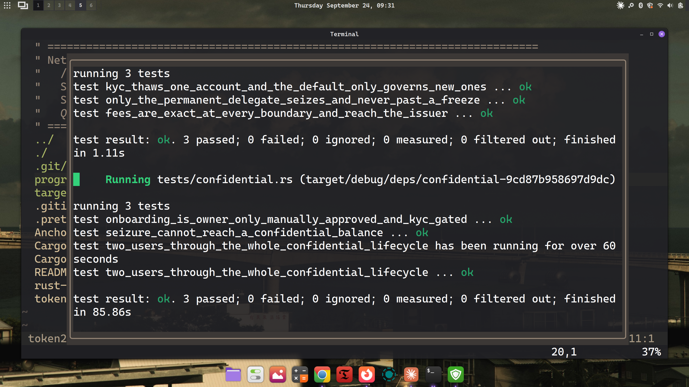

# t22

A Token-2022 remittance stablecoin, as an Anchor program: a protocol transfer
fee, KYC-gated accounts, metadata in the mint itself, a seizure authority, and
confidential transfers.

## The two mints

**`create_remittance_mint`** — `TransferFeeConfig`, `MetadataPointer` aimed at
the mint itself, `DefaultAccountState(Frozen)`, `MintCloseAuthority`.

**`create_confidential_mint`** — the same set re-issued with
`PermanentDelegate` and confidential transfers at `approve_policy = manual`.
A new mint address, not an upgrade: extensions initialize only before
`InitializeMint`.

## Layout

| path | |
|---|---|
| [`src/lib.rs`](programs/t22/src/lib.rs) | the program |
| [`src/confidential_lifecycle.md`](programs/t22/src/confidential_lifecycle.md) | configure → approve → deposit → apply → transfer → withdraw |
| [`src/seizure_vs_confidentiality.md`](programs/t22/src/seizure_vs_confidentiality.md) | why a seizure authority cannot reach a hidden balance |
| `tests/` | `mint`, `authority`, `confidential` |

## Tests



Eight tests cover all 16 instructions against the compiled program in litesvm.
The suite was cut from 29, and each remaining test does more:

- every rejection asserts the **exact** error and that the accounts involved
  are **byte-for-byte unchanged** — no `is_err()`
- boundaries are tested one unit either side: fee rounding and cap, balances,
  supply at close, the fee schedule's activation epoch
- a two-user lifecycle checks after every step that supply is fully accounted
  for, including encrypted balances and fees

Writing them this way found a bug: mints were funded for 8 bytes of metadata
they never allocate. It is fixed, and the exact-rent assertion guards it.

| test | covers |
|---|---|
| `remittance_mint_from_creation_to_close` | v1 mint, allowlist, close at zero supply |
| `confidential_mint_carries_the_forced_extension_and_cannot_be_retrofitted` | v2 mint and the extension Token-2022 forces |
| `kyc_thaws_one_account_and_the_default_only_governs_new_ones` | KYC thaw vs default state |
| `fees_are_exact_at_every_boundary_and_reach_the_issuer` | fee transfer, epoch switch, harvest, collect |
| `only_the_permanent_delegate_seizes_and_never_past_a_freeze` | seizure |
| `onboarding_is_owner_only_manually_approved_and_kyc_gated` | configure, approve, deposit |
| `two_users_through_the_whole_confidential_lifecycle` | apply, confidential transfer, withdraw |
| `seizure_cannot_reach_a_confidential_balance` | the gap |

## Build and test

```bash
cargo build-sbf
cargo test
```

Proofs are generated in the test and pre-verified into context state accounts;
a program cannot build one, since that needs the ElGamal secret. The lifecycle
test takes a minute or two on proof generation.
