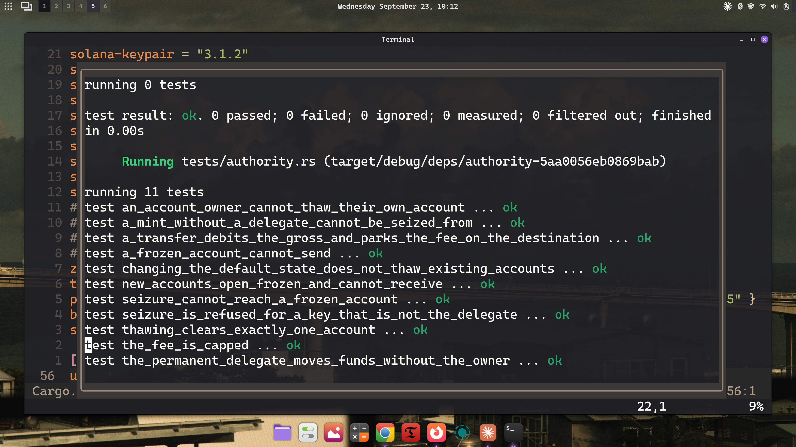

# t22

A Token-2022 remittance stablecoin, as an Anchor program: a protocol transfer
fee, KYC-gated accounts, metadata in the mint itself, a seizure authority, and
confidential transfers.



## The two mints

**`create_remittance_mint`** — `TransferFeeConfig`, `MetadataPointer` aimed at
the mint itself, `DefaultAccountState(Frozen)`, `MintCloseAuthority`.

**`create_confidential_mint`** — the same set re-issued with
`PermanentDelegate` and confidential transfers at `approve_policy = manual`.
A new mint address, not an upgrade: extensions initialize only before
`InitializeMint`.

## Layout

| path | |
|---|---|
| [`src/lib.rs`](programs/t22/src/lib.rs) | the program |
| [`src/confidential_lifecycle.md`](programs/t22/src/confidential_lifecycle.md) | configure → approve → deposit → apply → transfer → withdraw |
| [`src/seizure_vs_confidentiality.md`](programs/t22/src/seizure_vs_confidentiality.md) | why a seizure authority cannot reach a hidden balance |
| `tests/` | `mint`, `authority`, `confidential` |

## Build and test

```bash
cargo build-sbf
cargo test
```

Tests run against the compiled program in litesvm. Proofs are generated in the
test and pre-verified into context state accounts — a program cannot build one,
since that needs the ElGamal secret.
